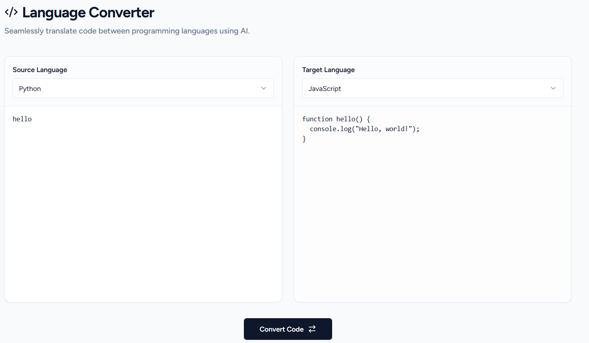

# AI Code Language Converter

A modern web application for converting code between programming languages using AI. This project uses **Vanilla HTML/JS**, **Tailwind CSS**, and **Shadcn UI** aesthetics.

## Quick Start
- Clone this repository.
- Open `index.html` in any browser.

## API Setup
To use the code conversion feature, you must configure your own API endpoint:
- Obtain your KeyMorph API Key at the official website: [keymorph.dedyn.io](https://www.keymorph.dedyn.io/).
- Open `index.html` and replace `REPLACE_WITH_YOUR_API_KEY` with your unique API endpoint code.

## License
MIT License. Open-source project created by [T2-Astra](https://github.com/T2-Astra).
